```mermaid
%%{init: {'theme':'base', 'themeVariables': { 'primaryColor':'#00ff9f', 'primaryTextColor':'#0d1117', 'primaryBorderColor':'#00ff9f', 'lineColor':'#ff00aa', 'secondaryColor':'#0d1117', 'tertiaryColor':'#1a1a2e'}}}%%
flowchart LR
    subgraph In["Trace ingestion (Langfuse only)"]
        L["LangfuseTraceService"]
        T["TraceStorageService"]
        L -->|fetch_traces| T
    end
    style L fill:#0d1117,stroke:#00ff9f
    style T fill:#0d1117,stroke:#00ff9f
```

```mermaid
%%{init: {'theme':'base', 'themeVariables': { 'primaryColor':'#00ff9f', 'primaryTextColor':'#0d1117', 'primaryBorderColor':'#00ff9f', 'lineColor':'#ff00aa', 'secondaryColor':'#0d1117', 'tertiaryColor':'#1a1a2e'}}}%%
flowchart LR
    subgraph Analysis["Error analysis (plan §1–2)"]
        E["collect_error_tasks"]
        A["run_error_analysis_agent\n(§1 invokable)"]
        P["Parallel runner\n(§2)"]
        E -->|tasks| P
        P -->|per task| A
        A -->|findings| P
    end
    style E fill:#0d1117,stroke:#00ff9f
    style A fill:#0d1117,stroke:#00ff9f
    style P fill:#1a1a2e,stroke:#ff00aa
```

```mermaid
%%{init: {'theme':'base', 'themeVariables': { 'primaryColor':'#00ff9f', 'primaryTextColor':'#0d1117', 'primaryBorderColor':'#00ff9f', 'lineColor':'#ff00aa', 'secondaryColor':'#0d1117', 'tertiaryColor':'#1a1a2e'}}}%%
flowchart LR
    subgraph Synth["Synthesis (plan §3–4)"]
        F["parallel_error_findings"]
        M["Main tracer agent\n(tool or step)"]
        H["harness_change_set"]
        F -->|state| M
        M -->|agent-produced| H
    end
    style F fill:#0d1117,stroke:#00ff9f
    style M fill:#1a1a2e,stroke:#ff00aa
    style H fill:#0d1117,stroke:#00ff9f
```

```mermaid
%%{init: {'theme':'base', 'themeVariables': { 'primaryColor':'#00ff9f', 'primaryTextColor':'#0d1117', 'primaryBorderColor':'#00ff9f', 'lineColor':'#ff00aa', 'secondaryColor':'#0d1117', 'tertiaryColor':'#1a1a2e'}}}%%
flowchart TB
    subgraph Tracer["Deep-agent tracer"]
        M["Middleware chain"]
        Model["Model"]
        Tools["Tools"]
        M -->|before/after| Model
        Model -->|tool_calls| Tools
        Tools -->|ToolMessage| Model
    end
    style M fill:#1a1a2e,stroke:#00ff9f
    style Model fill:#0d1117,stroke:#00ff9f
    style Tools fill:#0d1117,stroke:#ff00aa
```

```mermaid
%%{init: {'theme':'base', 'themeVariables': { 'primaryColor':'#00ff9f', 'primaryTextColor':'#0d1117', 'primaryBorderColor':'#00ff9f', 'lineColor':'#ff00aa', 'secondaryColor':'#0d1117', 'tertiaryColor':'#1a1a2e'}}}%%
flowchart TB
    Client["Client"]
    API["POST /api/tracer/run"]
    Svc["TraceAnalyzerService"]
    Lang["LangfuseTraceService\n(Langfuse only)"]
    Store["TraceStorageService"]
    Sand["SandboxService"]
    Graph["build_deep_agent_tracer\n(§3–4 synthesis)"]
    Agg["Aggregation §5"]
    HITL["Approve/apply §6"]
    DB[(DB)]
    Client -->|run_id, filters, opts| API
    API --> Svc
    Svc --> Lang
    Svc --> Store
    Svc --> Sand
    Lang -->|traces| Svc
    Store -->|load| Svc
    Svc -->|invoke| Graph
    Sand -->|sandbox_path| Svc
    Store --> DB
    Graph -->|harness_change_set| Agg
    Agg -->|merged| HITL
    Svc --> Agg
    HITL -->|TracerRunResponse| API
    API --> Client
    style Client fill:#1a1a2e,stroke:#ff00aa
    style API fill:#0d1117,stroke:#00ff9f
    style Svc fill:#0d1117,stroke:#00ff9f
    style Graph fill:#0d1117,stroke:#00ff9f
    style Lang fill:#0d1117,stroke:#00ff9f
    style Store fill:#0d1117,stroke:#00ff9f
    style Sand fill:#0d1117,stroke:#00ff9f
    style Agg fill:#1a1a2e,stroke:#ff00aa
    style HITL fill:#1a1a2e,stroke:#ff00aa
    style DB fill:#1a1a2e,stroke:#00ff9f
```

> **agent-trace** — ARCHITECTURE MAP | IMPLEMENTATION PLAN INTEGRATED

---

# agent-trace

**An agent that analyzes experiment traces and suggests targeted improvements to your agent harness.**

---

## Purpose

**agent-trace** exists to make harness improvement **repeatable and automated**. Instead of manually sifting through failed runs, you:

- **Fetch** experiment traces from **Langfuse** (trace source is Langfuse only; no LangSmith).
- **Analyze** errors in parallel via an invokable error-analysis agent (Section 1) and inject aggregated findings into tracer state (Section 2).
- **Synthesize** structured harness change suggestions (Section 3: tool or step; Section 4: main agent only, rule-based middleware removed) so the **main tracer agent** produces the `HarnessChangeSet`.
- **Aggregate** agent suggestions with optional feedback (Section 5), then expose **propose → review → approve/apply** (Section 6) for human-in-the-loop.
- **Verify** before exit via the existing pre-completion verification loop (Section 7: document and optionally harden with deterministic context).

The main objective is to **build an agent that improves your agent's harness**—debugging where agents go wrong (reasoning errors, missed verification, timeouts, etc.) and turning that signal into concrete, actionable changes.

---

## Overview

The system implements the **Trace Analyzer** flow from the implementation plan: **fetch from Langfuse → store/load → parallel error-analysis agents → main agent synthesizes findings + suggestions → aggregate feedback → human-in-the-loop**. A **deep-agent** tracer (single graph built with `create_deep_agent`) runs inside a sandbox with tools to read traces, list/read/edit files, and run commands. Middleware enforces **plan–build–verify–fix** behavior, time and step budgets, loop detection, and a **pre-completion verification** pass so the agent does not exit without running tests. The plan is executed in **seven atomic sections** (see table below); trace source is **Langfuse only**.

**Audience:** Teams running agentic experiments who want automated trace analysis and harness improvement suggestions without hand-inspecting every failure.

---

## Implementation phases (from plan)

| Section | Goal |
|--------|------|
| **1** | Single invokable error-analysis agent: `TraceErrorTask` → `list[ErrorAnalysisFinding]`. |
| **2** | Parallel agent execution and state injection: run Section 1 agent per task, set `parallel_error_findings` / `parallel_error_count` in state. |
| **3** | Synthesis tool or step so the main tracer agent produces `HarnessChangeSet` from findings. |
| **4** | Synthesis prompts + remove rule-based synthesis middleware; only main agent produces harness change set. |
| **5** | Aggregation step: merge agent-produced suggestions with optional feedback into one `HarnessChangeSet`. |
| **6** | API for proposed changes and approve/apply (human-in-the-loop). |
| **7** | Pre-completion verification and deterministic context: document build–verify–fix loop; optionally inject task spec into checklist. |

*Full detail: `IMPLEMENTATION_PLAN.md`.*

---

## Architecture — Parts

### Trace ingestion and storage

**Role:** Bring experiment traces into the system from **Langfuse** and persist them by `run_id` for the tracer. **Trace source is Langfuse only** (no LangSmith).

| Component | Role |
|-----------|------|
| **LangfuseTraceService** | Fetches traces by filters (`trace_ids`, `run_name`, time range, `limit`, `environment`). Normalizes payload to `NormalizedTrace`. |
| **TraceStorageService** | Saves/loads traces (e.g. PostgreSQL). Query by `run_id` or `trace_ids`. |
| **TraceAnalyzerService** | Orchestrator: calls Langfuse → coerces `run_id` → save → load; passes loaded traces and sandbox into the tracer. |

*Rendered in neon green/cyan and magenta on dark for cyberpunk look.*



---

### Error analysis and parallel injection (plan Sections 1–2)

**Role:** Turn stored trace errors into **findings** via an invokable agent (Section 1) and run it in parallel (Section 2); inject aggregated findings into tracer state.

| Component | Role |
|-----------|------|
| **error_analysis_agent** | `collect_error_tasks(traces)` → `TraceErrorTask` list; Section 1 adds `run_error_analysis_agent(task) -> list[ErrorAnalysisFinding]`. Rule-based `_default_error_analyzer` remains as fallback. |
| **Parallel runner** | Section 2: invoke Section 1 agent per task; aggregate findings; set `parallel_error_findings`, `parallel_error_count` in state. |
| **TracerParallelErrorAnalysisMiddleware** | When `run_id` set, loads traces, runs parallel analysis (agent or rule-based), injects findings into state. |

*Rendered in neon green/cyan and magenta on dark for cyberpunk look.*



---

### Synthesis and harness changes (plan Sections 3–4)

**Role:** Main tracer agent produces **HarnessChangeSet** from `parallel_error_findings` (Section 3: tool or step; Section 4: synthesis prompts, rule-based middleware removed).

| Component | Role |
|-----------|------|
| **deep_agent_tracer** | Section 3: synthesis tool or synthesis step writes agent-produced `harness_change_set` into state. Section 4: rule-based `TracerHarnessSynthesisMiddleware` removed or bypassed. |
| **tracer_prompts** | Section 4: synthesis instructions so the main agent knows when/how to produce harness changes from findings. |
| **harness_change_synthesis** | Kept as reference/fallback only; primary path is agent-driven (Section 3–4). |

*Rendered in neon green/cyan and magenta on dark for cyberpunk look.*



---

### Deep-agent tracer

**Role:** The single agent graph that operates on traces and sandbox to produce harness change suggestions; middleware enforces verification and budgets.

| Component | Role |
|-----------|------|
| **build_deep_agent_tracer** | Builds the graph via `create_deep_agent` (model, system_prompt, tools, middleware). |
| **TracerState** | Canonical state: `messages`, `run_id`, `sandbox_path`, reasoning fields, verification/budget/loop fields, `parallel_error_findings`, `harness_change_set`, etc. |
| **tracer_prompts** | Plan–build–verify–fix system prompt; Section 4 adds synthesis instructions. |
| **Tools** | `read_trace`, `list_directory`, `read_file`, `edit_file`, `run_command` (sandbox-scoped via state `sandbox_path`). |

**Middleware (in order):** state schema → parallel error analysis injection → harness synthesis (Section 4: bypassed when agent produces changes) → local context → sandbox scope → time budget → reasoning budget → loop detection → pre-completion verification (Section 7: documented/hardened).

*Rendered in neon green/cyan and magenta on dark for cyberpunk look.*



---

### Aggregation and human-in-the-loop (plan Sections 5–6)

**Role:** After the graph returns, merge agent suggestions with optional feedback (Section 5); expose propose → review → approve/apply (Section 6).

| Component | Role |
|-----------|------|
| **TraceAnalyzerService** | Section 5: run aggregation after graph return; merge `harness_change_set` with optional feedback → single `HarnessChangeSet`. |
| **routers/tracer** | Section 6: endpoints for proposed changes and approve/apply (or reject); apply only on approval (or documented auto-apply). |

---

### API and frontend

**Role:** Expose the Trace Analyzer as a runnable workflow and show results.

| Component | Role |
|-----------|------|
| **POST /api/tracer/run** | Accepts `run_id` (or `trace_ids`), optional `target_repo_url`, filters, evaluation command, limits. Returns `TracerRunResponse`: counts, `harness_change_set`, optional `improvement_metrics`. |
| **TraceAnalyzerService.analyze** | Creates sandbox (if `target_repo_url`), invokes tracer graph with `run_id`, `sandbox_path`, budgets; Section 5 aggregation; builds response from graph result; optional baseline/post-change evaluation. |
| **Frontend** | React/Vite UI: tracer run form, display of harness change summary and metrics. |

---

## Architecture — Whole system

End-to-end: **Client** calls **POST /api/tracer/run** → **TraceAnalyzerService** fetches traces from **Langfuse**, persists and loads them, creates a **sandbox** (if URL given), builds the **deep-agent tracer**, invokes it with initial state (`run_id`, `sandbox_path`, budgets). Inside the graph, **middleware** injects parallel error findings (Section 2; agent or rule-based); the **model** uses **tools** in the sandbox and is nudged by verification, time, and loop-detection middleware. The main agent produces **harness_change_set** (Section 3–4). **Aggregation** (Section 5) merges with optional feedback; **API** (Section 6) exposes propose → approve/apply. Result is returned in the API response; the **frontend** shows counts and change summary. **Pre-completion verification** (Section 7) is documented and optionally hardened with deterministic context.

**Boundaries:** Backend (FastAPI, Uvicorn), frontend (Vite dev server), DB (PostgreSQL/pgvector), optional Chrome for E2E. Trace source: **Langfuse only**. All services run via Docker Compose; backend uses `uv` and Alembic.

*Rendered in neon green/cyan and magenta on dark for cyberpunk look.*



---

## Tradeoffs

| Area | Choice | Rationale / alternative |
|------|--------|-------------------------|
| **Trace source** | **Langfuse only** | Explicit plan decision; no LangSmith adapter. Keeps one integration surface and aligns with Langfuse-first deployments. |
| **Error analysis** | **Invokable agent (Section 1) + parallel runner (Section 2)**; rule-based fallback | Agent path gives nuanced findings; parallel execution scales; rule-based fallback for tests or low-cost mode. |
| **Synthesis** | **Main agent produces HarnessChangeSet** (Section 3–4); rule-based middleware removed | Agent-driven synthesis for nuance and trace-aware suggestions; rule-based kept only as reference/fallback. |
| **Agent implementation** | Single **deep-agent** graph (`create_deep_agent`) | Reuse library routing, middleware, and state contract; fewer moving parts. |
| **Verification** | **Pre-completion verification** middleware (Section 7: document + optional deterministic context) | Reduces “code looks ok” early exits; plan–build–verify–fix and checklist force a verification turn before exit. |
| **Human-in-the-loop** | **Propose → review → approve/apply** (Section 6) | Changes applied only after approval (or documented auto-apply); avoids overfitting and regressions. |
| **Runtime** | **Docker Compose** (db, backend, frontend, chrome); backend `uv` + Alembic | Simple local and CI story; port separation avoids clashes with other stacks. |

---

## Quick start

**Prerequisites:** Docker, Docker Compose.

```bash
# Build and start all services (db, backend, frontend, chrome)
docker compose build
docker compose up -d

# Run DB migrations
docker compose exec backend uv run alembic upgrade head

# Backend: http://localhost:8001  (API docs: http://localhost:8001/docs)
# Frontend: http://localhost:5174
```

**Trigger a tracer run:** POST to `http://localhost:8001/api/tracer/run` with a body that includes at least `run_id` or `trace_ids` (and optionally `target_repo_url`, `run_name`, time filters, `evaluation_command`, `max_runtime_seconds`, `max_steps`). Or use the frontend form.

**Useful commands (from AGENTS.md):**

- Restart backend after code changes: `docker compose restart backend`
- Full reset: `docker compose down -v --rmi all` then `docker compose build` and `docker compose up -d`
- Backend tests: `docker compose exec backend uv run pytest`
- Logs: `docker compose logs -f backend`

---

## Links

| Resource | Path |
|----------|------|
| **Implementation plan** | `IMPLEMENTATION_PLAN.md` |
| **Completed work log** | `completed.md` |
| **Agent / run instructions** | `AGENTS.md` |
| **Architecture tracker** | `ARCHITECTURE_TRACKER.md` |

---

*README integrates `IMPLEMENTATION_PLAN.md` (Sections 1–7), `completed.md`, `AGENTS.md`, and the agent-trace codebase. Trace source: Langfuse only. Whole-system and parts aligned with the plan.*
