```mermaid
%%{init: {'theme':'base', 'themeVariables': { 'primaryColor':'#00ff9f', 'primaryTextColor':'#0d1117', 'primaryBorderColor':'#00ff9f', 'lineColor':'#ff00aa', 'secondaryColor':'#0d1117', 'tertiaryColor':'#1a1a2e'}}}%%
flowchart LR
    subgraph In["Trace ingestion"]
        L["LangfuseTraceService"]
        T["TraceStorageService"]
        L -->|fetch_traces| T
    end
    style L fill:#0d1117,stroke:#00ff9f
    style T fill:#0d1117,stroke:#00ff9f
```

```mermaid
%%{init: {'theme':'base', 'themeVariables': { 'primaryColor':'#00ff9f', 'primaryTextColor':'#0d1117', 'primaryBorderColor':'#00ff9f', 'lineColor':'#ff00aa', 'secondaryColor':'#0d1117', 'tertiaryColor':'#1a1a2e'}}}%%
flowchart TB
    subgraph Tracer["Deep-agent tracer"]
        M["Middleware chain"]
        Model["Model"]
        Tools["Tools"]
        M -->|before/after| Model
        Model -->|tool_calls| Tools
        Tools -->|ToolMessage| Model
    end
    style M fill:#1a1a2e,stroke:#00ff9f
    style Model fill:#0d1117,stroke:#00ff9f
    style Tools fill:#0d1117,stroke:#ff00aa
```

```mermaid
%%{init: {'theme':'base', 'themeVariables': { 'primaryColor':'#00ff9f', 'primaryTextColor':'#0d1117', 'primaryBorderColor':'#00ff9f', 'lineColor':'#ff00aa', 'secondaryColor':'#0d1117', 'tertiaryColor':'#1a1a2e'}}}%%
flowchart LR
    subgraph Analysis["Analysis & synthesis"]
        E["Error analysis\n(parallel)"]
        H["Harness synthesis"]
        E -->|findings| H
    end
    style E fill:#0d1117,stroke:#00ff9f
    style H fill:#0d1117,stroke:#ff00aa
```

```mermaid
%%{init: {'theme':'base', 'themeVariables': { 'primaryColor':'#00ff9f', 'primaryTextColor':'#0d1117', 'primaryBorderColor':'#00ff9f', 'lineColor':'#ff00aa', 'secondaryColor':'#0d1117', 'tertiaryColor':'#1a1a2e'}}}%%
flowchart TB
    Client["Client"]
    API["POST /api/tracer/run"]
    Svc["TraceAnalyzerService"]
    Lang["LangfuseTraceService"]
    Store["TraceStorageService"]
    Sand["SandboxService"]
    Graph["build_deep_agent_tracer"]
    DB[(DB)]
    Client -->|run_id, filters, opts| API
    API --> Svc
    Svc --> Lang
    Svc --> Store
    Svc --> Sand
    Lang -->|traces| Svc
    Store -->|load| Svc
    Svc -->|invoke| Graph
    Sand -->|sandbox_path| Svc
    Store --> DB
    Graph -->|harness_change_set| Svc
    Svc -->|TracerRunResponse| API
    API --> Client
    style Client fill:#1a1a2e,stroke:#ff00aa
    style API fill:#0d1117,stroke:#00ff9f
    style Svc fill:#0d1117,stroke:#00ff9f
    style Graph fill:#0d1117,stroke:#00ff9f
    style Lang fill:#0d1117,stroke:#00ff9f
    style Store fill:#0d1117,stroke:#00ff9f
    style Sand fill:#0d1117,stroke:#00ff9f
    style DB fill:#1a1a2e,stroke:#00ff9f
```

> **agent-trace** — ARCHITECTURE MAP | BUILD AN AGENT TO IMPROVE YOUR AGENT'S HARNESS

---

# agent-trace

**An agent that analyzes experiment traces and suggests targeted improvements to your agent harness.**

---

## Purpose

**agent-trace** exists to make harness improvement **repeatable and automated**. Instead of manually sifting through failed runs, you:

- **Fetch** experiment traces (e.g. from Langfuse or compatible backends).
- **Analyze** errors in parallel and inject findings into a **deep-agent** tracer.
- **Synthesize** structured harness change suggestions (config, prompts, tools) so you can apply targeted fixes and avoid regressions.

The main objective is to **build an agent that improves your agent's harness**—debugging where agents go wrong (reasoning errors, missed verification, timeouts, etc.) and turning that signal into concrete, actionable changes.

---

## Overview

The system implements a **Trace Analyzer** flow: **fetch → store/load → analyze → synthesize**. A **deep-agent** tracer (single graph built with `create_deep_agent`) runs inside a sandbox with tools to read traces, list/read/edit files, and run commands. Middleware enforces **plan–build–verify–fix** behavior, time and step budgets, loop detection, and a **pre-completion verification** pass so the agent does not exit without running tests. Parallel error analysis (today: rule-based functions; extensible to agents) and deterministic harness-change synthesis produce a **HarnessChangeSet** (config/prompt/tool suggestions) returned to the API and UI.

**Audience:** Teams running agentic experiments who want automated trace analysis and harness improvement suggestions without hand-inspecting every failure.

---

## Architecture — Parts

### Trace ingestion and storage

**Role:** Bring experiment traces into the system and persist them by `run_id` for the tracer.

| Component | Role |
|-----------|------|
| **LangfuseTraceService** | Fetches traces by filters (`trace_ids`, `run_name`, time range, `limit`, `environment`). Normalizes payload for internal use. |
| **TraceStorageService** | Saves/loads traces (e.g. PostgreSQL). Query by `run_id` or `trace_ids`. |
| **TraceAnalyzerService** | Orchestrator: calls Langfuse → coerces `run_id` → save → load; passes `loaded_traces` and sandbox into the tracer. |

*Rendered in neon green/cyan and magenta on dark for cyberpunk look.*



---

### Deep-agent tracer

**Role:** The single agent graph that operates on traces and sandbox to produce harness change suggestions.

| Component | Role |
|-----------|------|
| **build_deep_agent_tracer** | Builds the graph via `create_deep_agent` (model, system_prompt, tools, middleware). |
| **TracerState** | Canonical state schema: `messages`, `run_id`, `sandbox_path`, reasoning fields, verification/budget/loop fields, `parallel_error_findings`, `harness_change_set`, etc. |
| **tracer_prompts** | Plan–build–verify–fix system prompt (planning & discovery, build, verify, fix, testable code). |
| **Tools** | `read_trace`, `list_directory`, `read_file`, `edit_file`, `run_command` (sandbox-scoped via state `sandbox_path`). |

**Middleware (in order):** state schema → parallel error analysis injection → harness synthesis injection → local context → sandbox scope → time budget → reasoning budget → loop detection → pre-completion verification.

*Rendered in neon green/cyan and magenta on dark for cyberpunk look.*



---

### Error analysis and harness synthesis

**Role:** Turn stored trace errors into findings and then into a structured **HarnessChangeSet**.

| Component | Role |
|-----------|------|
| **error_analysis_agent** | `collect_error_tasks(traces)` → list of `TraceErrorTask`; `analyze_errors_in_parallel(tasks, analyzer=...)` → list of `ErrorAnalysisFinding`. Default analyzer is rule-based (keywords: timeout, validation, permission, path, json/parse). Pluggable `AnalyzerFn` for custom/LLM analyzers. |
| **TracerParallelErrorAnalysisMiddleware** | Loads traces by `run_id`, runs parallel analysis, injects `parallel_error_findings` into state. |
| **harness_change_synthesis** | `synthesize_harness_changes_from_findings(state)` maps findings to **HarnessChangeSet** (config/prompt/tool suggestions). |
| **TracerHarnessSynthesisMiddleware** | Runs synthesis from `parallel_error_findings`, injects `harness_change_set` / `harness_changes` into state. |

*Rendered in neon green/cyan and magenta on dark for cyberpunk look.*



---

### API and frontend

**Role:** Expose the Trace Analyzer as a runnable workflow and show results.

| Component | Role |
|-----------|------|
| **POST /api/tracer/run** | Accepts `run_id` (or `trace_ids`), optional `target_repo_url`, filters, evaluation command, limits. Returns `TracerRunResponse`: counts, `harness_change_set`, optional `improvement_metrics`. |
| **TraceAnalyzerService.analyze** | Creates sandbox (if `target_repo_url`), invokes tracer graph with `run_id`, `sandbox_path`, budgets; builds `HarnessChangeSet` from graph result; optional baseline/post-change evaluation. |
| **Frontend** | React/Vite UI: tracer run form, display of harness change summary and metrics. |

---

## Architecture — Whole system

End-to-end: **Client** calls **POST /api/tracer/run** → **TraceAnalyzerService** fetches traces (Langfuse), persists and loads them, creates a **sandbox** (if URL given), builds the **deep-agent tracer** via `build_deep_agent_tracer`, invokes it with initial state (`run_id`, `sandbox_path`, budgets). Inside the graph, **middleware** injects parallel error findings and synthesized harness changes; the **model** uses **tools** (read_trace, list_directory, read_file, edit_file, run_command) in the sandbox and is nudged by verification, time, and loop-detection middleware. Result state’s **harness_change_set** is read by the service and returned in the API response; the **frontend** shows counts and change summary. Optional **improvement_metrics** come from running a baseline command, then the tracer, then a post-change command in the same sandbox.

**Boundaries:** Backend (FastAPI, Uvicorn), frontend (Vite dev server), DB (PostgreSQL/pgvector), optional Chrome for E2E. All services run via Docker Compose; backend uses `uv` and Alembic.

*Rendered in neon green/cyan and magenta on dark for cyberpunk look.*



---

## Tradeoffs

| Area | Choice | Rationale / alternative |
|------|--------|-------------------------|
| **Agent implementation** | Single **deep-agent** graph (`create_deep_agent`) instead of custom StateGraph | Reuse library routing, middleware, and state contract; fewer moving parts. Legacy StateGraph removed. |
| **Error analysis** | Parallel **functions** with rule-based default analyzer (pluggable `AnalyzerFn`) | Predictable, fast, no extra model cost. Tradeoff: not “parallel error analysis agents” yet; can add LLM/subagent analyzers later. |
| **Synthesis** | **Deterministic** mapping from findings to `HarnessChangeSet` in middleware | Stable, auditable suggestions. Tradeoff: main agent does not perform synthesis; could move to agent-driven synthesis for more nuance. |
| **Trace source** | **Langfuse**-oriented service (API abstracted) | Fits Langfuse-first deployments; LangSmith in lockfile allows future or alternate backends. |
| **Verification** | **Pre-completion verification** middleware forces one extra turn before exit | Reduces “code looks ok” early exits; encourages run-tests-and-compare-to-spec. Similar to a Ralph Wiggum–style hook. |
| **Runtime** | **Docker Compose** (db, backend, frontend, chrome); backend `uv` + Alembic | Simple local and CI story; port separation (e.g. 8001, 5174, 5433) avoids clashes with other stacks. |

---

## Quick start

**Prerequisites:** Docker, Docker Compose.

```bash
# Build and start all services (db, backend, frontend, chrome)
docker compose build
docker compose up -d

# Run DB migrations
docker compose exec backend uv run alembic upgrade head

# Backend: http://localhost:8001  (API docs: http://localhost:8001/docs)
# Frontend: http://localhost:5174
```

**Trigger a tracer run:** POST to `http://localhost:8001/api/tracer/run` with a body that includes at least `run_id` or `trace_ids` (and optionally `target_repo_url`, `run_name`, time filters, `evaluation_command`, `max_runtime_seconds`, `max_steps`). Or use the frontend form.

**Useful commands (from AGENTS.md):**

- Restart backend after code changes: `docker compose restart backend`
- Full reset: `docker compose down -v --rmi all` then `docker compose build` and `docker compose up -d`
- Backend tests: `docker compose exec backend uv run pytest`
- Logs: `docker compose logs -f backend`

---

## Links

| Resource | Path |
|----------|------|
| **Implementation plan** | `IMPLEMENTATION_PLAN.md` |
| **Completed work log** | `completed.md` |
| **Agent / run instructions** | `AGENTS.md` |
| **Architecture tracker** | `ARCHITECTURE_TRACKER.md` |

---

*README derived from `IMPLEMENTATION_PLAN.md`, `completed.md`, `AGENTS.md`, and the agent-trace codebase. No standalone `docs/` or `SYSTEM_ARCHITECTURE.md` present; whole-system and parts inferred from code and the above docs.*
